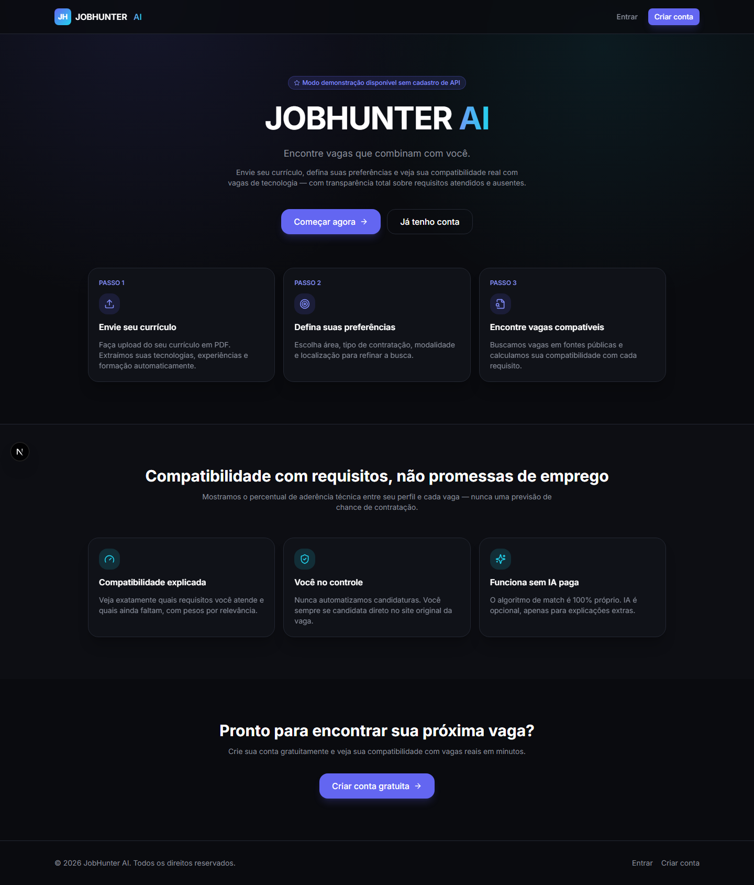
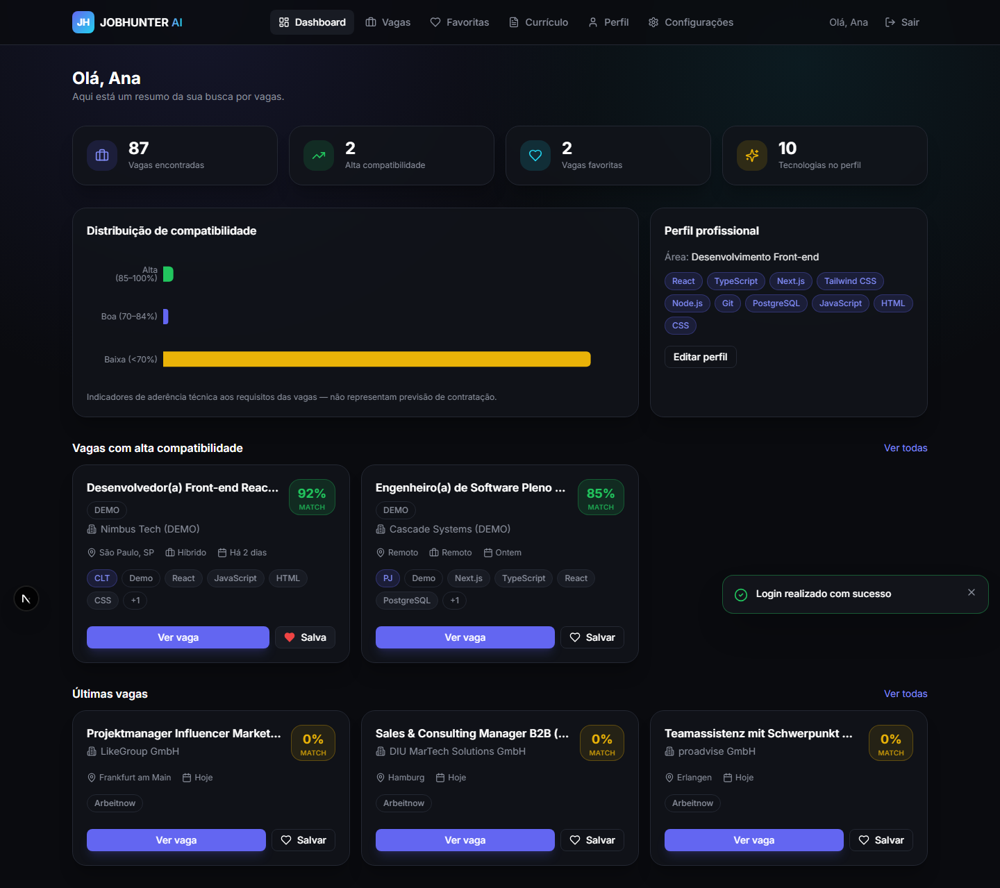
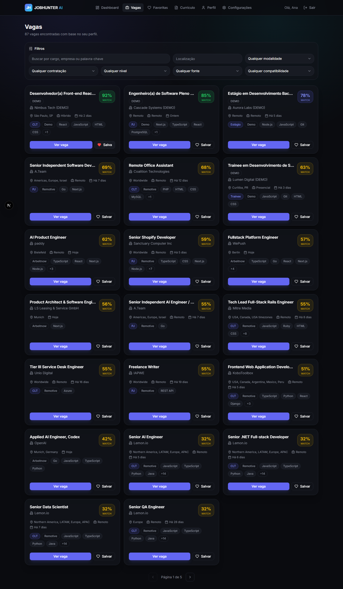
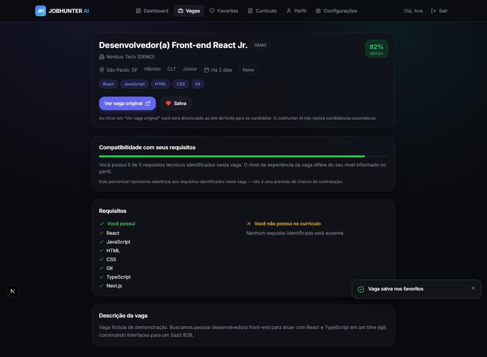
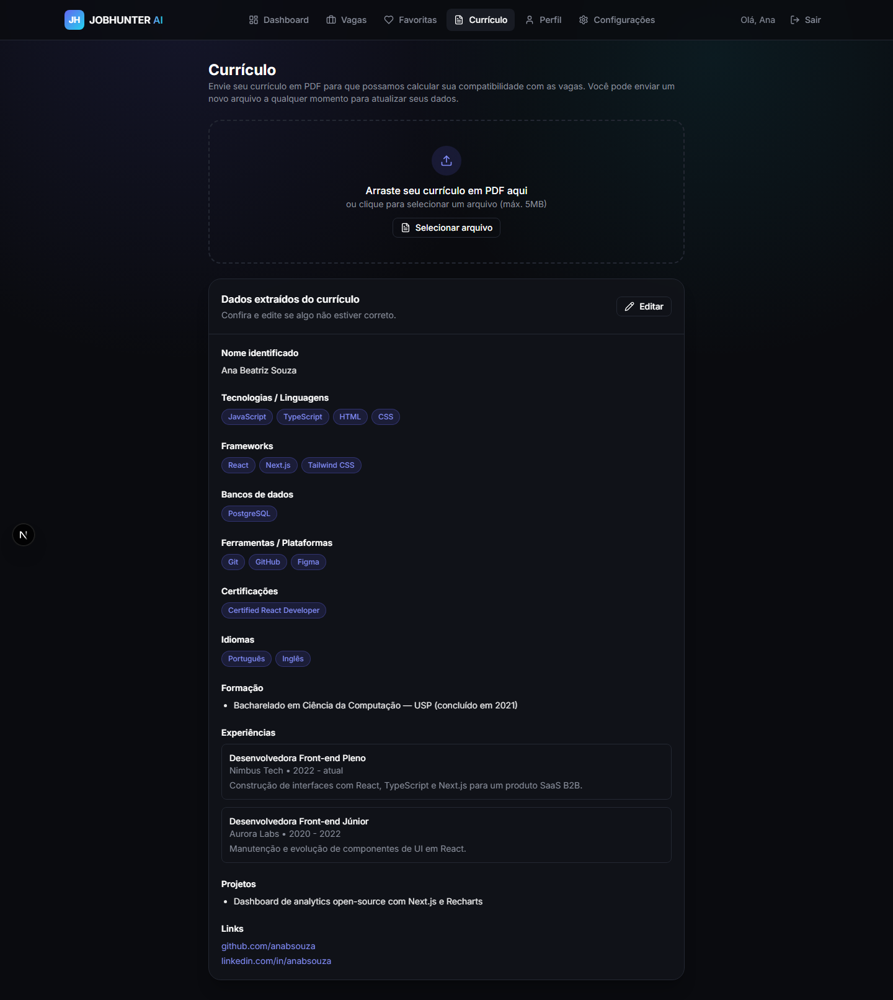
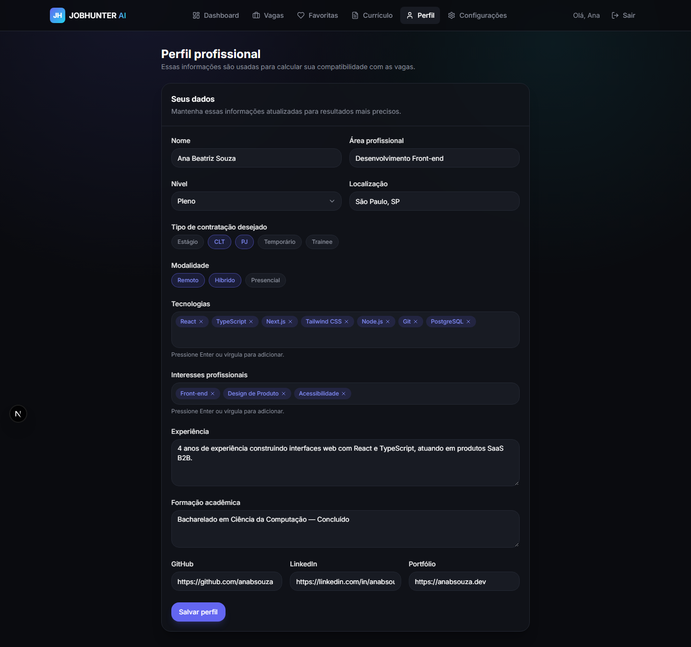

<div align="center">

# 🎯 JobHunter AI

### Encontre vagas que combinam com você.

Plataforma que analisa seu currículo, entende suas preferências e calcula sua **compatibilidade técnica real** com vagas de tecnologia — com transparência total sobre quais requisitos você atende e quais ainda faltam. Nunca automatiza candidaturas: você sempre se candidata direto no site original da vaga.

[](https://nextjs.org/)
[](https://www.typescriptlang.org/)
[](https://react.dev/)
[](https://supabase.com/)
[](https://tailwindcss.com/)
[](https://vitest.dev/)

<br/>

**[🔗 Ver demo ao vivo](https://jobhunter-ai-gamma.vercel.app)** · [Arquitetura](#arquitetura) · [Como rodar localmente](#como-instalar) · [Algoritmo de match](#como-funciona-o-algoritmo-de-match)

</div>

> ⚠️ O percentual de compatibilidade mostrado é uma medida de **aderência aos requisitos identificados na vaga**, calculada por um algoritmo próprio (sem depender de IA paga). Ele **não é** uma previsão de chance de contratação.

<br/>

<table>
<tr>
<td width="50%"></td>
<td width="50%"></td>
</tr>
<tr>
<td align="center"><sub><b>Landing page</b></sub></td>
<td align="center"><sub><b>Dashboard — vagas encontradas, compatibilidade e perfil</b></sub></td>
</tr>
<tr>
<td width="50%"></td>
<td width="50%"></td>
</tr>
<tr>
<td align="center"><sub><b>Busca de vagas com filtros e score por vaga</b></sub></td>
<td align="center"><sub><b>Detalhe da vaga — requisitos atendidos vs. ausentes</b></sub></td>
</tr>
<tr>
<td width="50%"></td>
<td width="50%"></td>
</tr>
<tr>
<td align="center"><sub><b>Extração automática de dados do currículo (PDF)</b></sub></td>
<td align="center"><sub><b>Perfil profissional usado no cálculo de match</b></sub></td>
</tr>
</table>

## Sumário

- [Tecnologias](#tecnologias)
- [Arquitetura](#arquitetura)
- [Como instalar](#como-instalar)
- [Configurar o Supabase](#configurar-o-supabase)
- [Configurar o `.env`](#configurar-o-env)
- [Executar localmente](#executar-localmente)
- [Executar os testes](#executar-os-testes)
- [Build de produção](#build-de-produção)
- [Deploy na Vercel](#deploy-na-vercel)
- [Fontes de vagas: configuração e como adicionar uma nova](#fontes-de-vagas)
- [Como funciona o algoritmo de match](#como-funciona-o-algoritmo-de-match)
- [Modo demonstração](#modo-demonstração)
- [Limitações conhecidas](#limitações-conhecidas)
- [Licença](#licença)

## Tecnologias

- [Next.js 15](https://nextjs.org/) (App Router) + [React 19](https://react.dev/) + [TypeScript](https://www.typescriptlang.org/) (strict mode)
- [Tailwind CSS](https://tailwindcss.com/)
- [Supabase](https://supabase.com/) (PostgreSQL, Auth, Storage, Row Level Security)
- [Vitest](https://vitest.dev/) para testes
- [Recharts](https://recharts.org/) para o gráfico de distribuição de compatibilidade
- Hospedagem: [Vercel](https://vercel.com/) (frontend) + [Supabase](https://supabase.com/) (banco, auth, storage) — ambos com free tier

Nenhuma dependência paga é obrigatória para rodar o projeto.

## Arquitetura

```
app/                        # Rotas (App Router)
  (app)/                     # Área autenticada (dashboard, jobs, profile, resume, favorites, settings)
  api/                       # Route handlers (upload de currículo, busca de vagas)
  login|register|...         # Páginas públicas de autenticação
components/                 # Componentes de UI, organizados por domínio
lib/
  ai/                        # Camada opcional de IA (funciona sem nenhum provedor configurado)
  actions/                   # Server Actions (mutações: perfil, preferências, favoritos, currículo)
  auth/                      # Checagens de permissão puras (testáveis sem banco)
  data/                      # Funções de leitura de dados (Supabase) usadas pelas páginas
  favorites/                 # Regras de negócio de favoritos (puras, testadas)
  jobs/
    sources/                 # Um adaptador por fonte de vagas (implementam JobSource)
    registry.ts               # Registro central de fontes
    normalize.ts / dedupe.ts  # Normalização e deduplicação de vagas
    sync.ts                   # Orquestra busca + normalização + persistência
    search-for-user.ts        # Busca + filtro + cálculo de match + paginação
  matching/                  # Algoritmo de compatibilidade (calculateMatch)
  resume/                    # Extração de texto e dados estruturados do PDF
  shared/                    # Catálogo de skills e labels compartilhados
  supabase/                  # Clientes Supabase (browser, server, admin, middleware)
supabase/migrations/        # Migrations SQL (schema, RLS, triggers, seed, storage)
types/                      # Tipos compartilhados (Database, Job, CandidateProfile, Match)
tests/                      # Testes unitários (Vitest)
```

A aplicação segue **funcionalidade > complexidade**: sem Redis, sem filas, sem microsserviços. Tudo roda em rotas Next.js + Postgres do Supabase.

## Como instalar

Pré-requisitos: [Node.js 20+](https://nodejs.org/) e uma conta gratuita no [Supabase](https://supabase.com/).

```bash
git clone <url-do-seu-repositorio>
cd buca-vagas
npm install
```

## Configurar o Supabase

1. Crie um projeto gratuito em [supabase.com](https://supabase.com/).
2. No [SQL Editor](https://supabase.com/docs/guides/database/overview#the-sql-editor) do seu projeto, execute, **nesta ordem**, os arquivos de `supabase/migrations/`:
   1. `0001_schema.sql` — cria as tabelas
   2. `0002_rls_policies.sql` — habilita Row Level Security e as políticas de acesso
   3. `0003_functions_triggers.sql` — triggers de `updated_at` e criação automática de perfil no cadastro
   4. `0004_seed.sql` — catálogo inicial de skills e registro das fontes de vagas
   5. `0005_storage.sql` — cria o bucket privado `resumes` para upload de currículos em PDF
3. Em **Project Settings → API**, copie a **Project URL**, a **anon public key** e a **service_role key**.
4. (Opcional) Em **Authentication → URL Configuration**, adicione `http://localhost:3000/auth/callback` e a URL de produção como Redirect URLs, para confirmação de e-mail e recuperação de senha funcionarem.

Alternativamente, com a [Supabase CLI](https://supabase.com/docs/guides/cli) instalada e o projeto linkado (`supabase link`), rode:

```bash
supabase db push
```

## Configurar o `.env`

Copie o arquivo de exemplo e preencha com os valores do seu projeto Supabase:

```bash
cp .env.example .env
```

| Variável | Obrigatória | Descrição |
|---|---|---|
| `NEXT_PUBLIC_SUPABASE_URL` | Sim | URL do projeto Supabase |
| `NEXT_PUBLIC_SUPABASE_ANON_KEY` | Sim | Chave pública (anon) do Supabase |
| `SUPABASE_SERVICE_ROLE_KEY` | Sim | Chave administrativa, usada apenas em rotas de servidor (nunca exposta ao browser) |
| `ANTHROPIC_API_KEY` | Não | Habilita explicações/resumos extras via IA. Sem ela, o sistema funciona normalmente usando apenas o algoritmo local |
| `INDEED_PARTNER_FEED_URL` / `INDEED_PARTNER_API_KEY` | Não | Reservadas para uma futura integração autorizada com a Indeed (ver [Fontes de vagas](#fontes-de-vagas)) |
| `NEXT_PUBLIC_APP_URL` | Sim | URL pública da aplicação (usada em links de e-mail) |

## Executar localmente

```bash
npm run dev
```

Acesse [http://localhost:3000](http://localhost:3000), crie uma conta em `/register` e você será redirecionado ao dashboard. Mesmo sem currículo ou preferências configuradas, a página `/jobs` já mostra vagas do **modo demonstração**.

## Executar os testes

```bash
npm run test        # roda uma vez
npm run test:watch  # modo watch
```

Os testes cobrem: cálculo de match (incluindo o exemplo de 83% da especificação do produto), normalização de vagas por fonte, deduplicação, validação e extração de currículo, filtros de busca, paginação, regras de favoritos e checagens de permissão/propriedade.

## Build de produção

```bash
npm run build
npm run start
```

## Deploy na Vercel

1. Suba o repositório para o GitHub.
2. Em [vercel.com/new](https://vercel.com/new), importe o repositório.
3. Configure as mesmas variáveis de ambiente do `.env` em **Project Settings → Environment Variables** (inclusive `SUPABASE_SERVICE_ROLE_KEY`, marcada como secreta).
4. Defina `NEXT_PUBLIC_APP_URL` como a URL final do deploy (ex.: `https://seu-app.vercel.app`).
5. Deploy. O build usa `next build` automaticamente — nenhuma configuração adicional é necessária.
6. Atualize as Redirect URLs no Supabase Auth com a URL de produção (`https://seu-app.vercel.app/auth/callback`).

## Fontes de vagas

A busca de vagas é implementada como uma camada de adaptadores em `lib/jobs/sources/`, todos implementando a interface `JobSource` (`types/job.ts`):

```ts
interface JobSource {
  key: string;
  name: string;
  isConfigured(): boolean;
  searchJobs(params): Promise<RawSourceJob[]>;
  getJob(sourceJobId): Promise<RawSourceJob | null>;
  normalizeJob(raw): NormalizedJob;
}
```

Fontes ativas hoje:

- **`demo`** — vagas fictícias, sempre disponíveis, usadas para testar o produto sem nenhuma configuração externa. Sempre marcadas com o badge `DEMO`.
- **`remotive`** — consome a [API pública da Remotive](https://remotive.com/api/remote-jobs), gratuita e documentada para uso automatizado, sem necessidade de autenticação.
- **`arbeitnow`** — consome a [API pública da Arbeitnow](https://www.arbeitnow.com/api/job-board-api), também gratuita e documentada.
- **`indeed`** — **não configurada por padrão**. A Indeed não oferece uma API pública de busca de vagas de uso livre; o acesso programático oficial exige um acordo de parceria (feed XML). O adaptador implementa a interface e fica pronto para uso futuro, mas nunca simula dados nem tenta contornar autenticação, CAPTCHA ou bloqueios. Para ativar, formalize a parceria e preencha `INDEED_PARTNER_FEED_URL`/`INDEED_PARTNER_API_KEY`.

O status de cada fonte fica visível em `/settings` e na tabela `job_sources`. Se uma fonte falhar (rede fora do ar, rate limit, etc.), o erro é registrado e as demais fontes continuam funcionando normalmente — a aplicação nunca quebra por causa de uma única fonte indisponível.

### Como adicionar uma nova fonte

1. Crie `lib/jobs/sources/<nome>.ts` implementando `JobSource`.
2. Garanta que `isConfigured()` só retorne `true` quando a fonte realmente puder ser usada (API pública sempre disponível, ou credenciais presentes no ambiente).
3. Implemente `normalizeJob()` para converter o formato da fonte no formato unificado `NormalizedJob`.
4. Registre a instância em `lib/jobs/registry.ts` (`JOB_SOURCES`).
5. (Opcional) Adicione uma linha em `supabase/migrations/0004_seed.sql` para a fonte aparecer em `/settings`.

Nenhum outro arquivo da aplicação precisa ser alterado — a busca, deduplicação e cálculo de match já funcionam com qualquer fonte registrada.

## Como funciona o algoritmo de match

Implementado em `lib/matching/calculate-match.ts`, sem depender de nenhuma API de IA. Para cada vaga:

1. As tecnologias da vaga são classificadas em **obrigatórias** (tags da vaga), **desejáveis** e **diferenciais** (mencionadas no texto da vaga perto de termos como "desejável" ou "diferencial").
2. Cada tecnologia do candidato é comparada com essas listas (com reconhecimento de sinônimos, ex.: "JS" = "JavaScript").
3. Localização, modalidade, tipo de contratação, nível e formação são comparados como dimensões adicionais — mas só entram no cálculo quando há dado suficiente dos dois lados (não penalizamos por ausência de informação).
4. Cada dimensão tem um peso (`lib/matching/weights.ts`): tecnologias obrigatórias pesam mais que desejáveis, que pesam mais que diferenciais; localização, modalidade, formação e nível têm peso médio; tipo de contratação tem peso mais baixo.
5. O score final é `pontos obtidos / pontos possíveis × 100`, arredondado.

O resultado inclui `matchedSkills`, `missingSkills` e uma explicação textual — nunca um número de "chance de contratação".

## Modo demonstração

Vagas da fonte `demo` (`lib/jobs/sources/demo-source.ts`) ficam sempre disponíveis e são claramente marcadas com o badge **DEMO** nos cards e na página de detalhes. Isso permite testar todo o fluxo — busca, match, favoritos, detalhes — mesmo em um ambiente novo, sem nenhuma fonte externa ou chave de IA configurada.

## Limitações conhecidas

- A extração de dados do currículo é heurística (baseada em texto e catálogo de skills conhecidas). PDFs digitalizados como imagem (sem texto selecionável) não são suportados — o upload é aceito, mas marcado como falha de processamento.
- A fonte Indeed não está configurada por padrão (ver acima).
- O algoritmo de match compara apenas o que está estruturado nos dados (tecnologias, localização, modalidade, tipo de contratação, nível, formação) — não interpreta nuances subjetivas da descrição da vaga a menos que uma API de IA esteja configurada.
- A sincronização de vagas externas acontece por requisição (com cache de 15 minutos via Next.js `fetch`), não há um job agendado de background nesta versão.
- `types/database.ts` é escrito à mão para espelhar as migrations; se o schema mudar, regenere com `supabase gen types typescript --linked > types/database.ts` (ajustando os imports conforme necessário).

## Licença

MIT.
